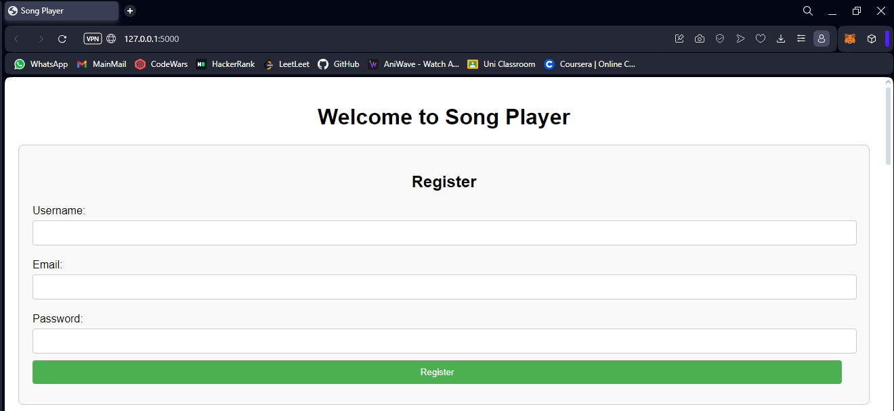

# Flask-Song-app
    A Simple song web app with flask as framework in python, sql as database that can add songs,manage playlists,etc.
### Prerequisites
    Python 3.0
    mysql
  
### Packages required:
    flask
    flask_cors
    mysql.connector

### Import sql table
    * Create Database named as song_player

### How to Run app:
    * Clone the repo to your local machine.
    * Install the above given packages.
    * Replace the user="root", password="ProjectDB123" ( lines 15, 16 in app.py) with your sql user and password.
    * Import the setup.sql using above steps.
    * Then do python3 app.py.
    * open http://127.0.0.1:5000/ in Your local browser.
    
### Features
     * Login
     * Register and verify using email.
     * Add songs, artists, and albums.
     * Create Private and public playlists.
     * See the other users Public playlists.
   
 ### Future improvements
      * Improve UI
      * Add downloaded songs in Playlists also.
      * Add Seek in Song palyer.
      * Improvement in Song Albums.
### Current Look
  